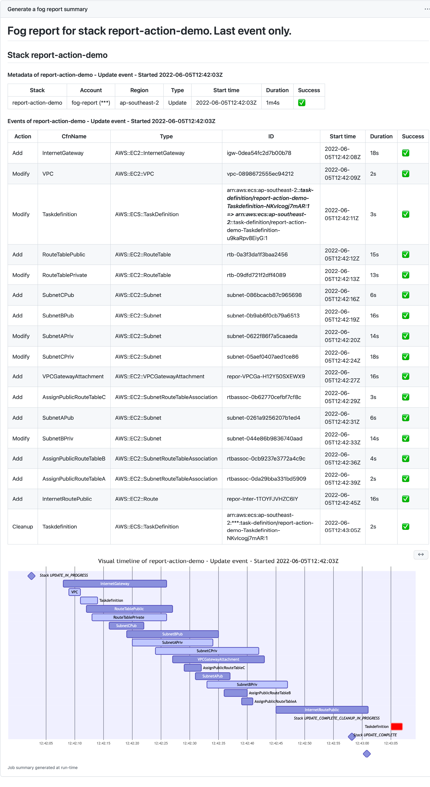

# fog-report-action

GitHub action to create a report about your CloudFormation deployment. You can run this after your CloudFormation deployment to see both in table and graph form how long everything took and where potential hiccups were. A screenshot is included below, but you can see the actual result in the actions of this repository as well.



This uses [fog](https://github.com/ArjenSchwarz/fog) to generate this report. More documentation on fog can be found in that repo.

## Usage

### TL;DR

Add the following to your GitHub action.

```yaml
  - name: fog report
    uses: ArjenSchwarz/fog-report-action@v1.0.0
    with:
      stackname: 'report-action-demo'
```

### The details

You require AWS credentials, which you likely will have set up already for your CloudFormation deployment, but if you're starting from scratch the [Configure AWS Credentials action](https://github.com/aws-actions/configure-aws-credentials) is as good place to look into the best way to set up your credentials. Credentials in any form acceptable to the AWS CLI will work for fog.

The required IAM permissions for this action are:

```json
{
    "Version": "2012-10-17",
    "Statement": [
        {
            "Action": [
                "cloudformation:DescribeStacks",
                "cloudformation:DescribeStackEvents"
            ],
            "Resource": "*",
            "Effect": "Allow"
        }
    ]
}
```

An example CloudFormation template to deploy this using the oidc connector as recommended by the Configure AWS Credentials action can be [found here](docs/oidc-role-with-minimal-permissions.yaml).

An example use of the GitHub action is below.

```yaml
# .github/workflows/main.yaml
on: [push]

jobs:
  fog_report:
    runs-on: ubuntu-latest
    name: Generate a fog report
    permissions:
      id-token: write
      contents: read
    steps:
      - name: Checkout
        uses: actions/checkout@v3
      - name: Configure AWS Credentials
        uses: aws-actions/configure-aws-credentials@v1
        with:
          role-to-assume: arn:aws:iam::155035777859:role/github-oidc-Role-1KGGNFPEDB3UR
          aws-region: ap-southeast-2
    #   - name: Your CloudFormation deployment goes here
      - name: fog report
        uses: ArjenSchwarz/fog-report-action@v1.0.0
        with:
          stackname: 'report-action-demo'
```

This results in an output similar to what you see in the examples in the [actions tab of this repo](https://github.com/ArjenSchwarz/fog-report-action/actions).

One thing you may note is that for security reasons GitHub obfuscates the account ID in the output. If your account has an alias set up, you can ensure that the role or user assumed by the action has permission to `iam:ListAccountAliases` as well as it will then show the account alias in the output. The account ID will still be shown as `***` including in arns, but at least it should show the account alias.

### Parameters

The only parameter currently required is the `stackname`. If you want to see the report for multiple stacks you can use a `*` wildcard to supply a name like `*demo`. You can have multiple wildcards.

## Contributions

If you wish to contribute in any way (reporting bugs, requesting features, writing code), feel free to do so either by opening Issues or Pull Requests. For Pull Requests, just follow the standard pattern.

1. Fork the repository
2. Make your changes
3. Make a pull request that explains what it does